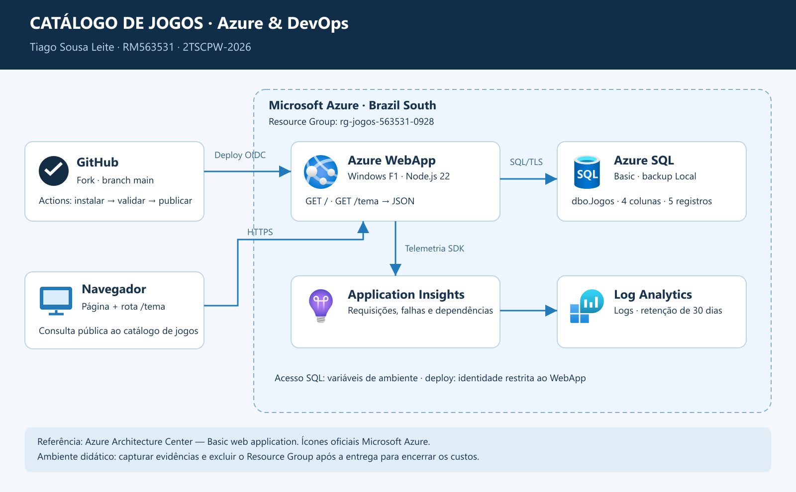

# Catálogo de Jogos - Azure & DevOps

Projeto didático de Tiago Sousa Leite, turma 2TSCPW-2026. Fork de `karlosmiguell/atividade-azure-devops`.

## Solução

Node.js 22 e Express em Azure App Service Windows F1. A rota `/tema` consulta `dbo.Jogos` no Azure SQL Basic, com cinco jogos. Application Insights coleta requisições, dependências e erros. GitHub Actions publica automaticamente os commits da branch `main`, autenticando via OIDC com uma identidade limitada ao WebApp.

Referência: [Basic web application - Azure Architecture Center](https://learn.microsoft.com/en-us/azure/architecture/web-apps/app-service/architectures/basic-web-app). Ícones: [Microsoft Azure](https://learn.microsoft.com/en-us/azure/architecture/icons/).

## Reproduzir

1. No Azure Cloud Shell Bash, revisar os nomes e executar `bash provision.sh`. Todos os recursos são criados por Azure CLI. F1 é gratuito; SQL Basic e monitoramento podem consumir créditos.
2. Na mesma sessão, executar `source /tmp/jogos-563531.env` e `bash github-oidc.sh`. Cadastrar os identificadores retornados nos secrets `AZURE_CLIENT_ID`, `AZURE_TENANT_ID` e `AZURE_SUBSCRIPTION_ID` do GitHub Actions.
3. Instalar as dependências com `(cd app && npm install --omit=dev)` e executar `node seed.cjs` para aplicar `seed.sql` no banco `jogosdb`. A conexão usa `DB_SERVER`, `DB_NAME`, `DB_USER` e `DB_PASSWORD`; não publicar valores de senhas.
4. Fazer commit na branch `main`. O workflow instala dependências, valida a sintaxe e publica a pasta `app`.
5. Validar `/`, `/tema` e a telemetria do Application Insights. Alterar o título/cor e fazer novo commit para comprovar CI/CD.
6. Após capturar as evidências, encerrar os custos com `az group delete --name rg-jogos-563531-0928 --yes` e confirmar com `az group exists --name rg-jogos-563531-0928`.

## Segurança e escopo

A senha SQL é gerada aleatoriamente e gravada apenas nas configurações do WebApp e em arquivo temporário restrito no Cloud Shell. O firewall permite serviços Azure (0.0.0.0 a 0.0.0.0), evitando a regra ampla para toda a Internet. HTTPS e validação de certificado SQL ficam habilitados. OIDC não usa senha de publicação persistente. Este ambiente é didático e temporário.

A CLI atual exige `--is-linux false` para criar o plano Windows. O script utiliza essa opção explicitamente.
